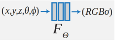
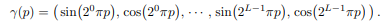

# NeRF
An implementation of NeRF for novel view synthesis.  
This project was done in collaboration with [Dushyant Patil](https://github.com/dushyant6) and under the guidance of [Prof. Nitin J. Sanket](https://nitinjsanket.github.io/index.html)

## What is NeRF?
A neural radiance field (NeRF) is a fully-connected neural network that can generate novel views of complex 3D scenes, based on a partial set of 2D images. The method relies on capturing camera poses for images of a fixed object and finding a RGB map and opacity map to recreate a 3D representation. The steps to create NeRF are as follows:  
* Data generation using COLMAP  
* 3D ray generation and volume sampling  
* Radiance field estimation using DL model
* Final image and video generation  

#### Data generation using COLMAP:
The data generation was done using 100 images of a backhoe-loader toy taken from different angles on a white background without reflections. The COLMAP package was used to find the camera properties and poses. The camera pose data, global C-sys, rotation quaternions, translation vectors, and focal length were determined with the help of COLMAP (As shown in Fig.14). The Cartesian coordinates and rotation matrices were converted to spherical coordinates to represent the pose of camera (x, y, z, θ, ϕ).  

#### 3D ray generation and volume sampling:
The camera pose matrix and focal length found in previous step are used to generate rays passing through every pixel of the image to the global coordinate system origin. Using the volume rendering technique mentioned in the [original paper](https://arxiv.org/abs/2003.08934), a set of 16 points were placed along each 3D rays. These query points are generated for all pixel to estimate the depth of the object from the camera. The querypoints in 5D are used to generate an RGB map and a density map of the scene using the deep learning architecture as follows:  
  
Having the network Fθ directly operate on xyzθϕ input coordinates results in renderings that perform poorly at representing high-frequency variation in color and geometry. Thus, the X,Y,Z out of the 5D points are converted to higher 60-dimensions and the θ and ϕ are converted to 24-dimensions before inputting them to the model. This mapping from R to R2L is done using positional encoding as follows:  
  

#### Radiance field estimation using DL model
The network architecture consists of 8 Linear layers activated by 8 Sigmoid activation functions. The Sigmoid function is used to find the probability of the object being present at a certain depth. The output of these 8 layers is the probability density of the object boundary in 3D. This density value (σ) is input to 3 more linear layers activated by Sigmoid, Relu, and Sigmoid respectively to find the RGB values of the points. For back-propagation, Adam optimizer was used with a learning rate of 5x10−4 . The loss calculated was MSE loss. The model was trained for 50000 iterations.  

#### 3D Reconstruction and video generation
The density and RGB values determined using the DL model are used to reconstruct the points in 3D. The depth values and probability values (σ) are used to find the 3D location of point while the RGB map is used to find the color/ intensity at the point. This 3D point cloud is used to create a video of the object in 3D by applying rotation around the global C-sys axes and storing the frames in the video object.  

## Output
the model at 1/4th image quality and obtained the following outputs for 1700 and 5000 iteration:  
* Ground Truth:  
  
* After 1700 Iterations:  
  
* After 5000 Iterations:  
  
